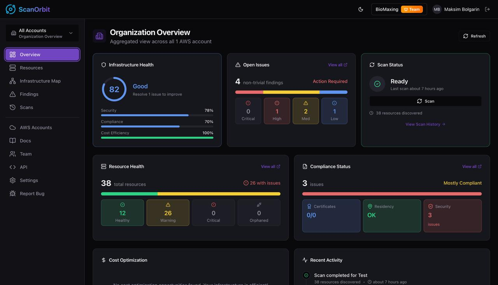

# ScanOrbit

ScanOrbit scans your AWS account through a read-only IAM role and shows you what's running, what's misconfigured, what's expiring, and what's costing you money. It's self-hosted and Apache-licensed — you point it at AWS through a role and nothing leaves your hardware.

[](https://github.com/maxbolgarin/scanorbit/actions/workflows/ci.yml)
[](./LICENSE)



## Install

The release pipeline publishes images to GHCR. Pull them and run:

```bash
mkdir scanorbit && cd scanorbit
curl -fsSL https://raw.githubusercontent.com/maxbolgarin/scanorbit/main/docker-compose.registry.yml -o compose.yml
curl -fsSL https://raw.githubusercontent.com/maxbolgarin/scanorbit/main/.env.example -o .env

for v in JWT_SECRET JWT_REFRESH_SECRET TOTP_ENCRYPTION_KEY OAUTH_ENCRYPTION_KEY; do
  sed -i.bak "s|^${v}=.*|${v}=$(openssl rand -hex 32)|" .env
done
rm .env.bak

docker compose up -d
```

Open <http://localhost:8080>. ScanOrbit boots in single-user mode by default — there's no login screen, you go straight to the dashboard. The first thing the UI asks is to connect an AWS account; it generates the IAM policy for you to paste into the AWS console.

To pin a version, set `SCANORBIT_VERSION=1.4.2` before `docker compose up -d`. Tags follow semver (`:1`, `:1.4`, `:1.4.2`, `:latest`).

If you'd rather build from source, clone the repo and run `docker compose up -d` against the default `docker-compose.yml` — it builds every image locally instead of pulling.

### Turning on real auth

Single-user mode is fine on a private network or behind a VPN. Don't run it on the public internet — anyone who can reach the port becomes an admin. Set `AUTH_ENABLED=true` in `.env` to turn on email/password signup, Google + GitHub OAuth, and 2FA. The first user to sign up becomes the admin.

## What it scans

The scanner walks EC2 (instances, volumes, EIPs, ENIs, NAT gateways, security groups), RDS (instances, snapshots), S3 (buckets, encryption, public-access blocks), ELBv2 (ALBs, NLBs, target groups), ACM certificates, Lambda, CloudWatch alarms and log groups, IAM (users, roles, access keys, MFA), KMS, and Secrets Manager.

The analyzer then flags the usual things: orphaned volumes, unused Elastic IPs, idle NAT gateways, security groups open to `0.0.0.0/0`, public S3 buckets, IAM users without MFA, long-unused access keys, certificates expiring within 30/60/90 days, resources sitting in regions you've blocked for data-residency reasons, and missing required tags. Full list of checks: [`docs/FINDINGS.md`](./docs/FINDINGS.md).

Findings show up in the web UI and can also fire signed webhooks, post to Slack, or roll up into daily/weekly email digests.

## Configuration

Everything goes in `.env`. The four 32-byte hex secrets are mandatory; the rest have working defaults. The ones you'll likely want to override:

- `AUTH_ENABLED=true` to require login (default is single-user mode).
- `FRONTEND_URL` — public URL of the web UI, used for cookies and email links.
- `TRUSTED_PROXIES` — comma-separated IPs your reverse proxy sits at, so the API trusts `X-Forwarded-For`.
- `RESEND_API_KEY` — turns on real transactional email; without it, verification codes are printed to the API logs.
- `LOG_LEVEL` — `debug` / `info` / `warn` / `error`.

`.env.example` has the full list, including OAuth credentials, Slack, retention TTLs, and the scanner concurrency/timeout knobs.

## Architecture

```
db        Postgres 17 — primary data store
redis     Redis 7     — job queue, rate limiting, sessions
migrate   one-shot    — runs migrations on boot
api       Hono.js     — REST API on :4000 (internal)
app       Nginx       — React SPA on :8080
scanner   Go          — discovers AWS resources
analyzer  Go          — security / cost / IAM analyzers
```

The API enqueues jobs into Redis; the Go workers pick them up and write results back to Postgres. The React app talks to the API. That's the whole picture.

## Public API

Auth via API key (Settings → API Keys → Create). All endpoints are under `/api/v1`:

```bash
curl -X POST https://your-host/api/v1/scans/trigger \
  -H "X-API-Key: sk_live_..." \
  -H "Content-Type: application/json" \
  -d '{"accountId":"<uuid>"}'

curl https://your-host/api/v1/scans/<scan-id> \
  -H "X-API-Key: sk_live_..."
```

The full OpenAPI reference is rendered at `/docs` inside the running app.

## Running it in production

If you're putting this behind a real domain, read these first:

- [docs/deployment.md](./docs/deployment.md) — production checklist
- [docs/tls-and-reverse-proxy.md](./docs/tls-and-reverse-proxy.md) — Caddy, Nginx, Traefik examples
- [docs/aws-iam.md](./docs/aws-iam.md) — minimal read-only IAM role policy
- [docs/backup-restore.md](./docs/backup-restore.md) — `pg_dump` and restore
- [docs/observability.md](./docs/observability.md) — Prometheus, logs, alerting

## Data retention

A retention job runs in the API container and prunes old Postgres rows. Defaults are conservative; bump or shrink them in `.env`:

```
RETENTION_RESOURCES_DAYS=180          # drop resources not seen in N days
RETENTION_FINDINGS_RESOLVED_DAYS=365  # drop resolved findings older than N days
RETENTION_SCANS_DAYS=730              # drop completed scan records older than N days
RETENTION_AUDIT_LOGS_DAYS=730         # drop audit log rows older than N days
```

## Development

```
make setup        # install deps, start db+redis, run migrations
make run          # full native stack
make infra        # just db+redis
make dev-api      # API on :4000
make dev-app      # Vite dev server on :5173
make dev-scanner  # scanner worker
make dev-analyzer # analyzer worker
```

`make help` lists every target. `make docker-run` brings the full stack up via Compose instead of native processes. `make test`, `make lint`, and `make typecheck` do what they say.

The API is Hono.js on Node 24, TypeScript strict. The workers are Go. The frontend is React 19 + Vite + Tailwind + Radix. The DB is Postgres 17 via Drizzle.

## Contributing

[CONTRIBUTING.md](./CONTRIBUTING.md) explains how to set up, how PRs should be structured, and what's in scope. Security issues go to the private channel described in [SECURITY.md](./SECURITY.md), not the public issue tracker.

## License

Apache 2.0 — see [LICENSE](./LICENSE).
